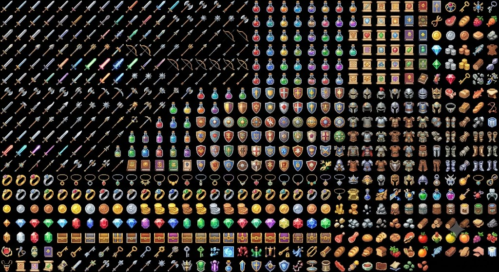
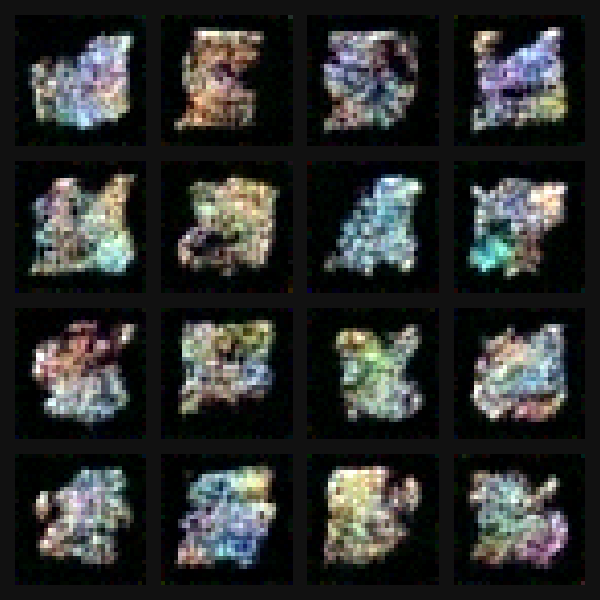
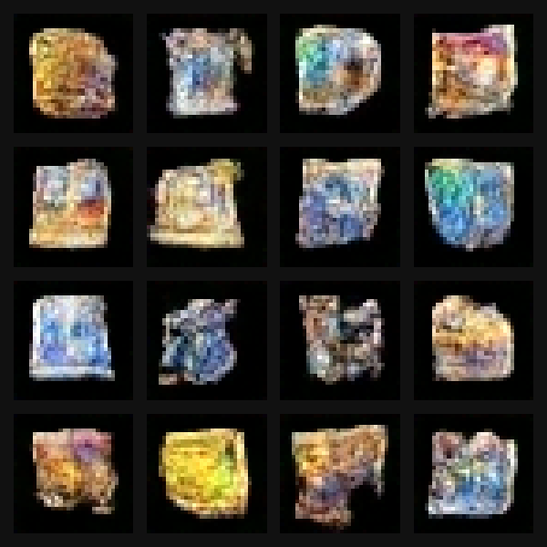
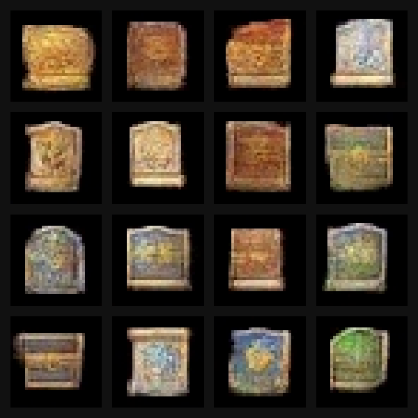
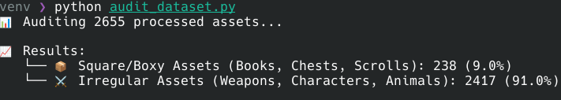

# Game Sprite Diffusion Engine
GSDE is a ground-up, raw PyTorch 3-channel (RGB) parametric diffusion engine optimized for the synthesis of discrete, low-resolution pixel asset manifolds. Utilizing a deep multi-stage U-Net architecture with explicit time-step parameterization and structural residual blocks, this engine maps random Gaussian distributions directly into coherent, stylized 16-bit color structures.

## 🚀 Architectural Blueprint & System Specs

The entire pipeline was engineered to bypass bloated third-party frameworks, maintaining a lean execution path that prioritizes compute efficiency and low-level matrix manipulation.

* **Throughput Optimization:** Sustained execution speed of **25 iterations/second** during the optimization phase.
* **Compute Footprint:** Peak VRAM allocation constrained to **1.3GB** under a continuous batch size of 64, with active GPU power consumption stabilized at **220W**.
* **Convergence Geometry:** Fully trained from scratch over **1,000 Epochs** (Total runtime: ~27 minutes), forcing the parametric global loss down to a hyper-stable **<0.02**.

---

## 🛠️ Data-Centric Engineering Pipeline

To maintain strict compliance and avoid utilizing copyrighted game assets, the training distribution was engineered from the ground up via a zero-shot bootstrapping strategy.

1. **Synthetic Generation:** High-fidelity raw texture sheets were generated using a frontier model.
2. **Morphological Tokenization:** A custom OpenCV preprocessing engine programmatically segmented, sliced, and isolated individual asset coordinates into uniform $28\times28$ matrices.
3. **Symmetric Padding:** Assets were centrally anchored and padded out to uniform $32\times32$ square tensors to align with standard convolutional grid layouts.

---

## 📊 Milestone Convergence & Visual Artifacts

The network maps multi-channel joint optimization problems across $R, G, \text{ and } B$ spatial distributions, transitioning explicitly from low-frequency global features to high-frequency structural boundaries.

### 🔹 Phase 1: Epoch 20 (The Macro-Manifold)
Early training cycles cleared out-of-distribution noise, locking the background canvas to absolute black bounds (`[-1, -1, -1]` normalized). The network isolated continuous RGB bands for specific palettes (potions, metals, woods) but boundaries remained soft.

### 🔹 Phase 2: Epoch 100 (Structural Organization)
The misty color distributions condensed into recognizable geometric bodies. The model isolated unique item layout rules, successfully drawing rectangular scroll structures and dense item clusters.

### 🔹 Phase 3: Epoch 1000 (High-Frequency Crystallization)
Full structural convergence. The network successfully minted a themed collection of assets including high-contrast golden parchment scrolls, distinct rounded medieval shields with internal crest variations, and highly articulate pixel-art treasure chests (complete with lid rims and lock shading).

---

## 🔬 Systems Post-Mortem: Inductive Bias & Dataset Leakage

An analytical audit of the final weight matrices revealed a distinct **Spatial Aspect Ratio Bias**: the network consistently anchored its output distributions to square or blocky configurations, even when attempting to render structurally irregular items (like weapons or limbs) known to exist in 91% of the source data.

### 🔍 Root Cause Analysis:
In low-resolution latent spaces ($32\times32$), spatial features like thin diagonal blades exhibit severe pixel sparsity. Conversely, block-based assets (scrolls, books, chests) represent high-density, low-entropy convolutional patterns. 

Because the morphological preprocessing pipeline forced every asset onto a rigid square grid and perfectly centered them, the U-Net's sliding convolutional kernels experienced **dataset alignment leakage**. The network's objective function quickly discovered that mapping continuous RGB gradients into centralized square footprints yielded the most rapid, mathematically stable reduction in Mean Squared Error (MSE). The system achieved excellent semantic variety (chests vs. shields vs. scrolls), but locked its global spatial parameters to this low-entropy geometric container.

### 🛠️ Production Scaling Strategies for Next-Gen Iterations:
1. **Class-Conditioned Embeddings (CFG):** Integrating explicit text/label tokens ($y$) into the residual blocks to allow cross-attention mechanisms to override the geometric gravity of the square blocks.
2. **Deterministic Sampler Upgrades:** Shifting from standard stochastic DDPM reverse tracks to a deterministic DDIM inference loop to sharpen fine, single-pixel lines without late-stage noise smearing.
3. **Spatial Augmentation:** Introducing random coordinate shifting, irregular scaling, and dynamic canvas padding during the preprocessing phase to break inductive bias alignment.
